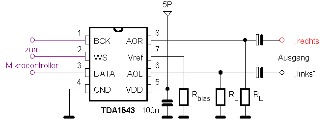
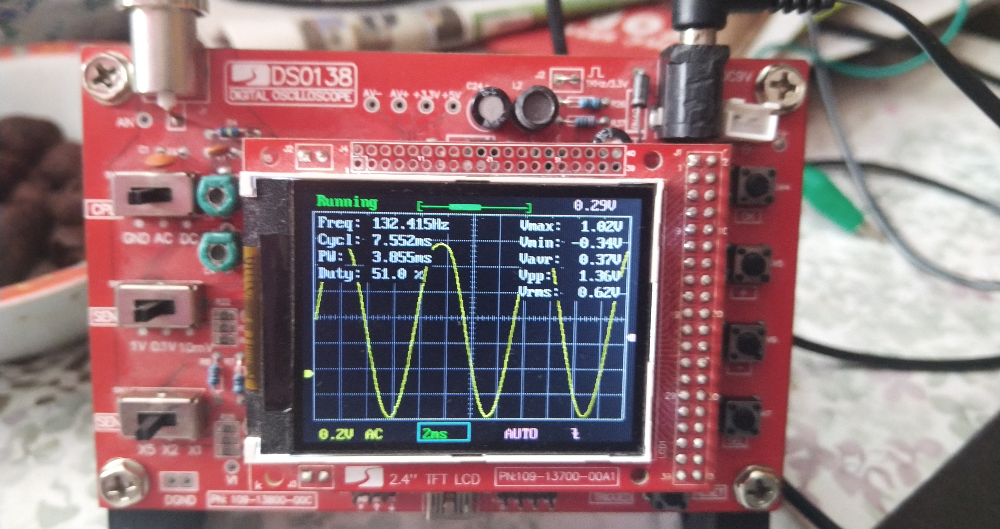
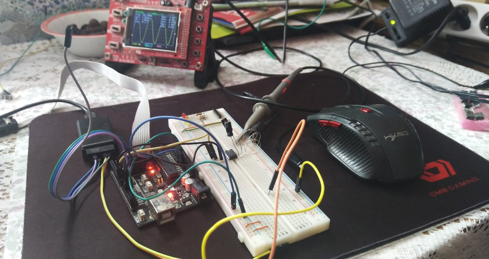

# AVR_TDA1543A
AVR TDA1543A (not TDA1543 with I2S interface!) simple program to run on AVR with SPI interface.
TDA1543A version use 24bit EIAJ format frame. Its simple to implement bus with SPI.
R=3x680R
C=2x4u7
Source of schematic 
https://www-user.tu-chemnitz.de/~heha/Mikrocontroller/TDA1543.htm

